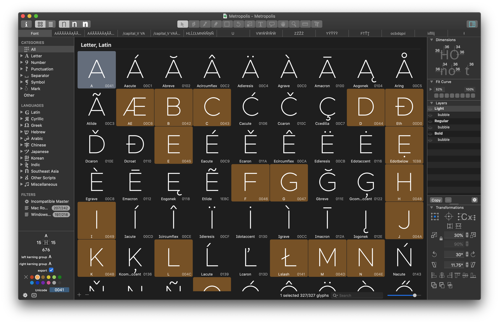
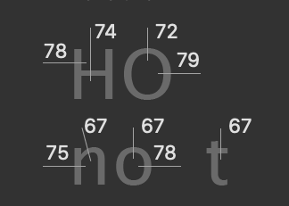
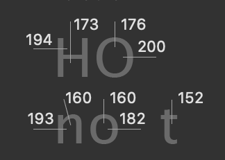
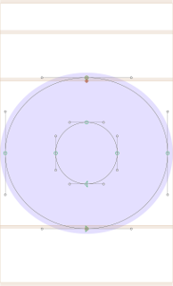
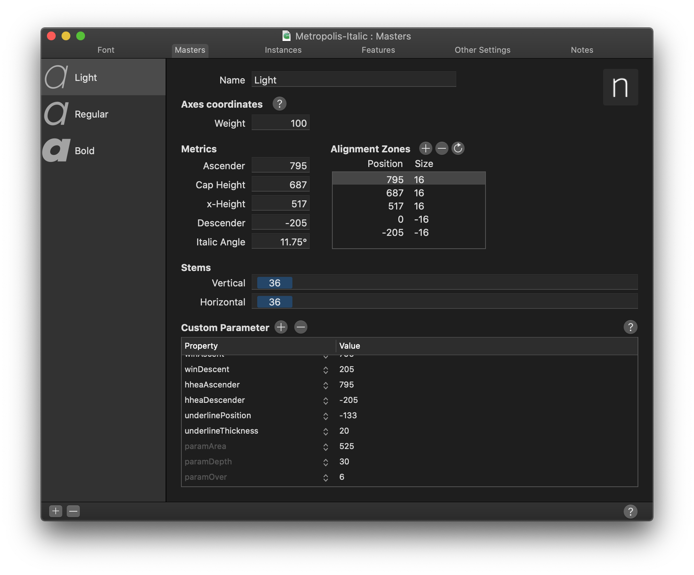
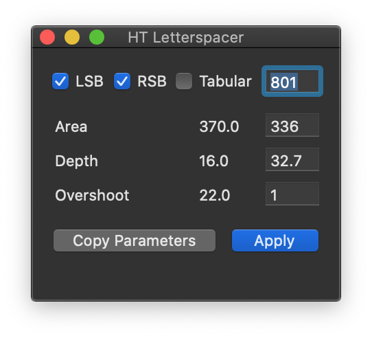
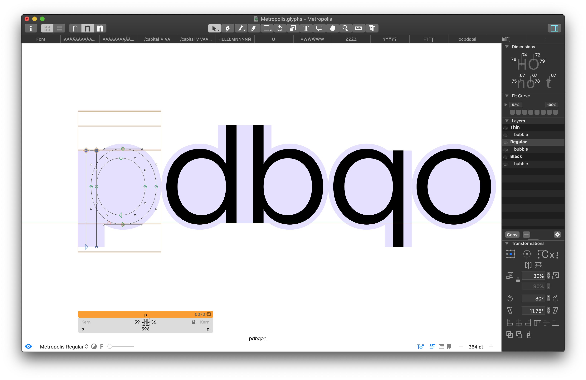
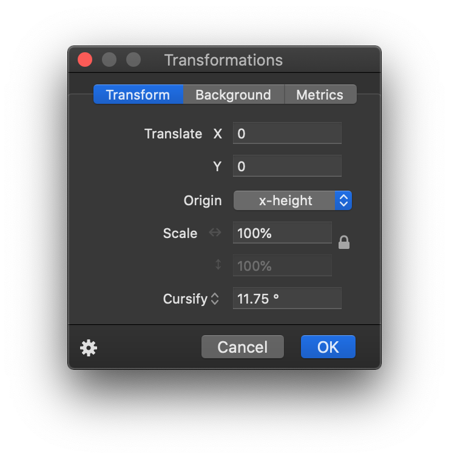
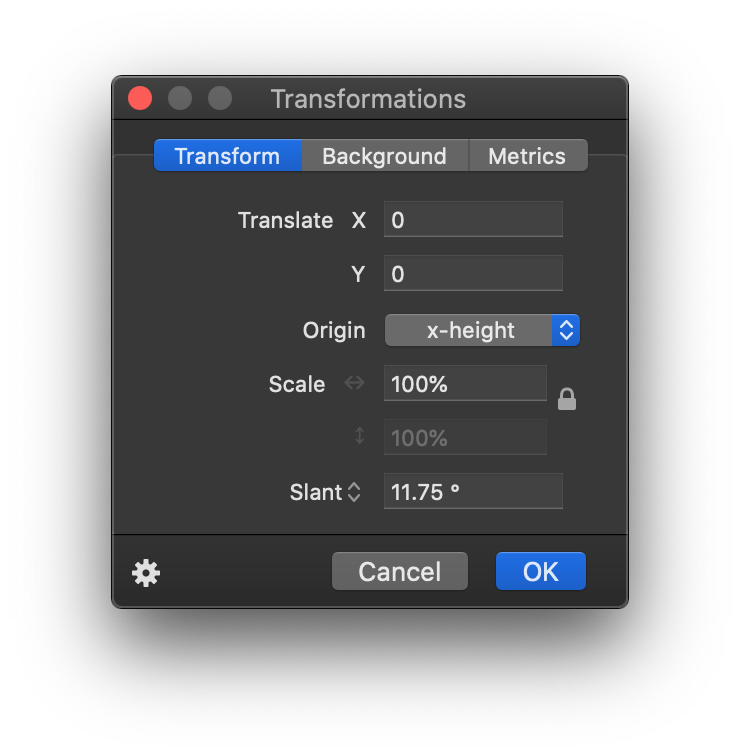

# <a name="documentation"></a> Documentation

## <a name="contents"></a> Table of Contents

* [Documentation](#documentation)
	* [Table of Contents](#contents) 	
	* [Workflow](#workflow)
	* [Metrics](#metrics)
		* [Italics](#italics)
		* [Dimensions/stroke width](#dimensions)
		* [Alignment Zones](#alignmentzones)
	* [HT Letterspacer](#htletterspacer)
	* [BubbleKern](#bubblekern)
	* [Cursify](#cursify)
	* [Release process](#releaseprocess)
	* [Export formats](#exportformats)
* [Future plans](#futureplans)
* [Alternative to Glyphs](#alternatives)
* [Submitting a PR](#PRs)

## <a name="workflow"></a> Workflow



Metropolis is built with an entirely Glyphs ([https://glyphsapp.com](https://glyphsapp.com)) based workflow. I can't recommend Glyphs enough, though it does come with a price tag.

The two plugins that are essential to this workflow are HT Letterspacer ([https://huertatipografica.github.io/HTLetterspacer/)](https://huertatipografica.github.io/HTLetterspacer/) and BubbleKern ([http://glyphsextensions.com/bubblekern/](http://glyphsextensions.com/bubblekern/)). More on both those below.

## <a name="metrics"></a> Metrics

Given an **em square of 1000**, the metrics for Metropolis are as follows:

| | Value
--- | -----
Ascender  | 795
Cap Height  | 687
x-Height  | 517
Descender  | -205

### <a name="italics"></a> Italics

The italics angle is universally **11.75°**.

### <a name="dimensions"></a> Dimensions or 'stroke width'

The dimensions are as follows:

Light | Regular | Black
--- | --- | ---
 |  | 

Example: If drawing something like an 'x', I likely will start with an elongated vertical bar with the same width as the vertical stem in 'n'. After rotating it the appropriate width to create the letter 'x' of the desired width, a lot of adjustment takes place. The final result cannot be reasonably estimated something akin to 'stroke width y at a degree of z'. This is essentially how all diagonals have been drawn to date. Start with an initial shape based off these dimensions and then infinite adjustment.

### <a name="alignmentzones"></a> Alignment Zones



Also across all current 6 masters, the alignment zones are +/- a value of **12**. This is a good value for this style of sans typeface for an em square of 1000, so I'll often use a value of 12, not just for Metropolis.

There likely should be many more formal values, but they don't exist. Pretty much all glyphs have been improvised beginning with the pen tool in Glyphs. I didn't draw this freehand as a prior step, becuase I wanted to get straight into the project in Glyphs. Maybe that's a 'wrong' way to do type design, but it works for me. That will explain why some outlikes are a bit primitive. For example, I'm still not really happy with the lowercase 'a' overall, but I am reluctant to change it to something already familiar over something original. This is an original work, not a copy, after all.

Armed with all the above metrics, you should be able draw a great many number of outlines/glyphs. There are 327 already there by my count. I say outlines, I have intentionally left out spacing until now.


## <a name="htletterspacer"></a> HT Letterspacer

HT Letterspacer is a tool that automatically calculates the appropriate left and right bearing on any glyph, essentially doing the spacing part of the design automatically.

In order for this to work, the plugin requires a few parameters, which can be found in the custom parameters in the masters tab of the font info window, namely `paramArea`, `paramDepth`, `paramOver`.



Checkout [https://huertatipografica.github.io/HTLetterspacer/)]() for a much more thorough explanation of this tool. Essentially the above metrics tell HT Letterspacer how much space to allocate. I have chosen the following values:

| | Thin | Regular | Black 
--- | ---- | ------- | -----
`paramArea` | 350 | 310 | 370
`paramDepth` | 5 | 7 | 16
`paramOver` | 2 | 9 | 22

I roughly understand what these numbers do, but I'm not going to explain how I've arrived at these specific values. A **lot** of fiddling, adjusting and trial & error.

In addition to this, each *.glyphs file needs a corresponding autospace file. For instance:

```
./Metropolis.glyphs
./Metropolis_Black_autospace.py
./Metropolis_Regular_autospace.py
./Metropolis_Thin_autospace.py
```

and

```
./Metropolis-Italic.glyphs
./Metropolis-Italic_Black_autospace.py
./Metropolis-Italic_Regular_autospace.py
./Metropolis-Italic_Thin_autospace.py
```

You will actually need a relatively new version of HT Letterspacer as I actually submitted a PR allowing masters/weights to have individually set values. (As far as I understand) the param values define overall weight (and/or rhythm) of the typeface, whereas the autospace file defines ratios between things like uppercase, small caps, lowercase, numbers etc.

Once both the plugin and these settings are correctly set up, you can invoke the tool one of two ways: 1) with the UI and 2) without. The UI allows you to manually override settings (which is not what we want), so I choose to always invoke it without the UI. Once invoked, you can easily repeat the operation with **Option + Command + R**.



When using this tool/making spacing adjustments, it's key to run it many times. You will see the glyphs coalesce into their eventual spacing, but it may actually take multiple runs of the tool for it to reach it's optimal point.

## <a name="bubblekern"></a> BubbleKern



After drawing and spacing our glyphs, we need to define approriate kerning information. This would be a mammoth job to do manually each release, so instead I'm using BubbleKern ([http://glyphsextensions.com/bubblekern/](http://glyphsextensions.com/bubblekern/)). If you think back to days of old physical type, imagine the 'bubbles' being the shaped physical block the glyph is mounted on. The block itself is contoured outside of the perimeter of the glyph to allow glyphs tightly align.

Basically for each outline layer, there needs to be a corresponding 'bubble' layer (see right hand side 'Layers' pane).

It is crucial the width of the corresponding layers are the same (e.g. the 'Thin' layer and it's immediately following 'bubble' layer) for this to work correctly.

Once defined/drawn for every glyph, BubbleKern is then run. I have prepared `Metropolis BubbleKern Pairs.txt` for this. **Any kern pairs must go in this file/BubbleKern must only be run using this file.**

As a guide, I am using 56, 53 & 50 as offset values when drawing the kern bubbles for Thin, Regular & Black, respectively. As a rule, I try to honor the values already arrived at by HT Letterspacer. 

## <a name="cursify"></a> Cursify

I'm largely using Glyph's 'Cursify' tool to do the italics. This yeilds better results that simply slanting the glyph shapes from the regular/normal glyph, though from memory I was doing something tricky like slanting the vertical bars and cursifying everything else.

Will update if/when I can recreate how I did this. Again, a lot of just eyeballing and trail and error.

Cursify | Slant
--- | ---
 | 

## <a name="releaseprocess"></a> Release process

Is as follows:

1. Remove all kerning
2. Draw
3. Space
4. Draw BubbleKern bubbles 
5. Re-Run BubbleKern (use ../Sources/Metropolis BubbleKer Pairs.txt)
6. Export 
7. Commit 
8. Create release tag

Note: Hoping to arrive at optimal BubbleKern outlines soon to negate the need to ever re-do these.

## <a name="exportformats"></a> Export formats

Once I've run BubbleKern, I create exports for OpenType, TrueType, UFO, EOT, WOFF & WOFF2.

# <a name="futureplans"></a> Future Plans

## Small Caps

There are some additional metrics that likely need to be defined before this can go ahead. There is an open PR for some caps, but I haven't reviewed and I'm not sure if spacing and/or kerning has been appropriately set.

## Rounded

A rounded version. Adjusting strokes an addition 12 points at cap ends.

## Slab/Serif

This one has had the least thought, but might be cool. Also could serve as some preliminary work for a possible monospaced version.

## Monospaced

As above

## Micro / Text / Display

This possibly would require an entire redrawing effort. The current metrics *kind of* work, but separating for different display sizes would likely need quite a rethink of the core metrics (and therefore spacing too). I don't really have any plans to do this. It's more of a 'if I was doing this all over again...' type thing.

# <a name="alternatives"></a> Alternative to Glyphs

At present, the best bet is the UFO export. However, if you want to request glyph, you must raise an issue and add your modified file as an attachment to the issue, rather than a pull request. I will only allow PRs to the glpyhs file.

This will in turn mean someone (likely myself) will need to translate this into an appropriate commit/PR.

# <a name="PRs"></a> Submitting a PR

I will only review PRs that are small and isolated and can be easily described and understood within the context of the PR rather than even needing to open it.

When saving the file for your PR close all other open tabs and leave one remaining with the added/modified glyphs visible. This makes it much easier to review PRs.

Please:

- Run the autospacing on your modified/created glyph before subitting as a PR
- Add relevant bubble kern to any modified/created glyph and set up as drescribed above
- Apply to all weights and both normal/italic where appropriate

Please do not:

- Modify any autospacing settings
- Modify any other kern bubbles
- Set manual kerns (or indeed run the kerning tool at all)
- Modify any glyphs not related to your changes

As a general rule, a small isolated commit should equal a small isolated PR. 


