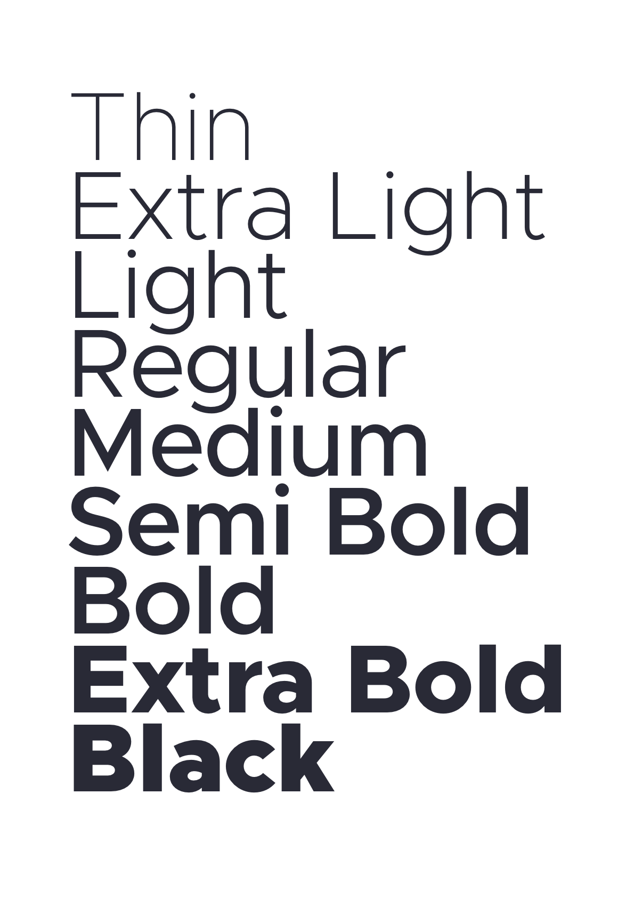

# The Metropolis Typeface

### The Vision

To create a modern, geometric typeface. Open sourced, and openly available. Influenced by other popular geometric, minimalist sans-serif typefaces of the new millenium. Designed for optimal readability at small point sizes while beautiful at large point sizes.

---

### May 2019 update

This typeface is very much still in development.

#### Spacing & Kerning status

Having spent many years delving into type design, Metropolis was my first serious attempt at designing something of production quality.

I didn't know how much I didn't know back then (who does?). I had no strategy for designing Metropolis, I literally bought a Glyphs license and jumped right in (think File > New and then start drawing). I have since learnt that spacing and kerning is something so important, you really need to think about it up front, i.e. before drawing anything serious.

That said, tools and plugins exist in the Glyph ecosystem that make the the process of designing much easier where it relates to spacing and kerning (HT Letterspacer & Bubble Kern, I'm looking at you).

The astute few may have already noticed there is/was already values for HT LetterSpacer and some BubbleKern layers. Unfortunately, the values already there weren't very good. I have done a lot of testing recently to arrive first at ideal spacing values, and then from that create kerning information. The spacing has to be done first, then kerning bubbles can be drawn from that spacing info. When you change the spacing information, the existing kern bubbles (and therefore derived values) aren't correct so need to be thrown away/redrawn.

Luckily, I think I now have a process for both describing this workflow, and automating it (somewhat). The spacing values are finalized. The kern bubbles have yet to be re-drawn. You can find before/after kerning specimens in the Images folder above.

I will be making all tools I use available here, but please bear with me. Also, I think the time has come to give some better documentation (around weights, spacing, kerning etc.) to make it easier (and hopefully encourage) contributions from others.

#### Italics

The italics in Metropolis were largely just 'cursify'-ing (a tool in Glyphs) the regular weight. Releases up until now have included this all in a single working file. Unfortunately, all this spacing and kerning workflow doesn't really play nice with having two styles in a single Glyphs file, so I have had to separate them. One benefit is the kerning (when done) will be unique to each style (and therefore, theoretically better).

#### Kerning groups

I've also started changing the kerning groups. This probably won't be a hugely noticible change, but it will mean slightly more kerning information will be associated with each glyph, making the overall font size slightly bigger (we're talking a few additional KBs per file, don't panic).

#### Glyphs App

As you can no doubt infer from all of the above. Metropolis is inherently a Glyphs based workflow. Metropolis is an open source project, Glyphs how ever is not. All I can say is, Glyphs is a really great tool, and I cannot recommend it more highly (I have never been in touch with the creators of Glyphs other than to buy a copy - this is not an advertisement). I'm a software developer too, and good software is made by people that need to get paid too.

Why do I say this? Because unfortunately I can not/will not accept any PRs that aren't directly to the *.glyphs file(s) in this project. Yes, I can import UFO into Glyphs (or TTF, for that matter), but I don't want to. This is already a massive file, and any PRs going forward will have to include correct spacing and kern bubbles. As far as I can see, that can only work if contributions are using the same workflow.

#### UFO

Based on the last workflow point, I have moved the UFO files to a UFO folder to correctly represent they are an export, and not in fact the source files.

#### Alternatives to the Glyphs App/UFO requirement

Alternatively, feel free to send me (ideally) SVGs (or some such) that are clearly somehow an em sq (this project uses 1000em, so a 1000px/1000pt SVG is fine) to discuss ideas, thoughts, contributions. There are many users of this project now so sudden stylistic changes likely won't go into the final output, but I welcome constructive ideas :)

#### Issues

I know there are a few issues accumulating. Sorry :( I'll soon be on top of it :) Many people have requested specific glyphs, they're actually already in master, I just haven't done a release in forever. There will be a release soon, I promise, I'm looking forward to the inbox for this project being zero 😅

### The License

Licensed under Open Font License (OFL). Available to anyone and everyone. Contributions welcome.

### Contact

Contact me via chris.m.simpson@icloud.com or http://twitter.com/ChrisMSimpson for any questions, requests or improvements (or just submit a pull request).

### Support

You can now support work on Metropolis via PayPal at http://paypal.me/chrismsimpson. No donation is too small (or large)!

